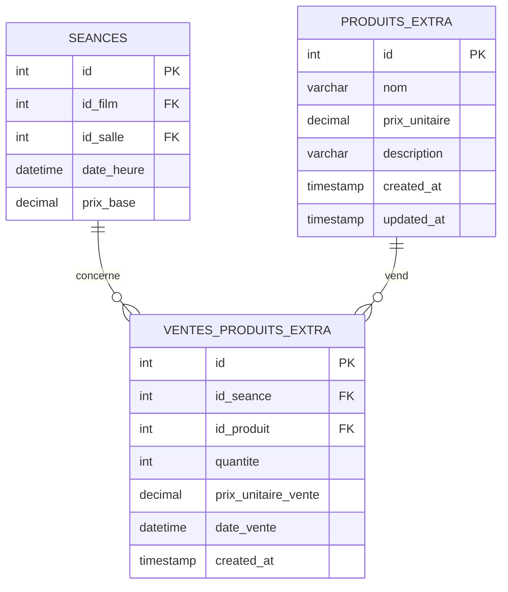

# 🍿 Spécifications Techniques - Produits Extras Cinéma

## 📋 Table des matières
1. [MCD (Modèle Conceptuel de Données)](#mcd)
2. [Maquettes d'écran](#maquettes)
3. [Fonctions Backend](#fonctions-backend)
4. [Fonctions Frontend](#fonctions-frontend)
5. [Classes et Controllers](#classes-et-controllers)
6. [Intégration Chiffre d'Affaires](#integration-ca)

---

## 🗂️ MCD (Modèle Conceptuel de Données) {#mcd}



### 📊 Tables SQL

```sql
-- Table des produits extras
CREATE TABLE produits_extra (
    id SERIAL PRIMARY KEY,
    nom VARCHAR(100) NOT NULL UNIQUE,
    prix_unitaire DECIMAL(10,2) NOT NULL,
    description TEXT,
    created_at TIMESTAMP DEFAULT CURRENT_TIMESTAMP,
    updated_at TIMESTAMP DEFAULT CURRENT_TIMESTAMP
);

-- Table des ventes de produits extras
CREATE TABLE ventes_produits_extra (
    id SERIAL PRIMARY KEY,
    id_seance INTEGER NOT NULL REFERENCES seances(id),
    id_produit INTEGER NOT NULL REFERENCES produits_extra(id),
    quantite INTEGER NOT NULL CHECK (quantite > 0),
    prix_unitaire_vente DECIMAL(10,2) NOT NULL,
    date_vente TIMESTAMP DEFAULT CURRENT_TIMESTAMP,
    created_at TIMESTAMP DEFAULT CURRENT_TIMESTAMP
);

-- Index pour optimisation
CREATE INDEX idx_ventes_seance ON ventes_produits_extra(id_seance);
CREATE INDEX idx_ventes_produit ON ventes_produits_extra(id_produit);
CREATE INDEX idx_ventes_date ON ventes_produits_extra(date_vente);
```

---

## 📱 Maquettes d'écran {#maquettes}

### 🛒 1. Formulaire Gestion Produits

```
┌─────────────────────────────────────────┐
│ 🍿 GESTION DES PRODUITS EXTRAS           │
├─────────────────────────────────────────┤
│ [+] Ajouter un produit                  │
├─────────────────────────────────────────┤
│ Nom du produit : [Popcorn     ]         │
│ Prix unitaire : [10 000      ] Ar      │
│ Description : [Popcorn sucré ]          │
│ [Enregistrer]                           │
├─────────────────────────────────────────┤
│ 📋 LISTE DES PRODUITS                   │
│ ✏️ 🗑️                                 │
│ Popcorn - 10,000 Ar                     │
│ Boisson - 5,000 Ar                      │
│ Bonbon - 2,000 Ar                       │
└─────────────────────────────────────────┘
```

### 💰 2. Formulaire Vente Produits

```
┌─────────────────────────────────────────┐
│ 💰 VENTE DE PRODUITS EXTRAS             │
├─────────────────────────────────────────┤
│ Séance : [Titanic - 25/01 10:00 ▼]     │
│ Produit : [Popcorn               ▼]     │
│ Quantité : [5]                         │
│ Prix unitaire : [10,000] Ar            │
│ Total : [50,000] Ar                    │
│ [Enregistrer la vente]                 │
├─────────────────────────────────────────┤
│ 📊 VENTES DU JOUR                      │
│ Titanic 10:00 - 5x Popcorn = 50,000 Ar │
│ Avatar 14:00 - 3x Boisson = 15,000 Ar │
└─────────────────────────────────────────┘
```

---

## 🔧 Fonctions Backend {#fonctions-backend}

### ProduitExtraController.java

```java
@RestController
@RequestMapping("/api/produits-extras")
public class ProduitExtraController {
    
    // GET /api/produits-extras
    // Retour: List<ProduitExtra>
    @GetMapping
    public ResponseEntity<List<ProduitExtra>> getAllProduits()
    
    // POST /api/produits-extras  
    // Retour: ProduitExtra
    @PostMapping
    public ResponseEntity<ProduitExtra> createProduit(@RequestBody ProduitExtra produit)
    
    // PUT /api/produits-extras/{id}
    // Retour: ProduitExtra
    @PutMapping("/{id}")
    public ResponseEntity<ProduitExtra> updateProduit(@PathVariable int id, @RequestBody ProduitExtra produit)
    
    // DELETE /api/produits-extras/{id}
    // Retour: void
    @DeleteMapping("/{id}")
    public ResponseEntity<Void> deleteProduit(@PathVariable int id)
}
```

### VenteProduitController.java

```java
@RestController
@RequestMapping("/api/ventes-produits")
public class VenteProduitController {
    
    // POST /api/ventes-produits
    // Retour: VenteProduit
    @PostMapping
    public ResponseEntity<VenteProduit> createVente(@RequestBody VenteProduit vente)
    
    // GET /api/ventes-produits/seance/{idSeance}
    // Retour: List<VenteProduit>
    @GetMapping("/seance/{idSeance}")
    public ResponseEntity<List<VenteProduit>> getVentesBySeance(@PathVariable int idSeance)
    
    // GET /api/ventes-produits/jour/{date}
    // Retour: List<VenteProduit>
    @GetMapping("/jour/{date}")
    public ResponseEntity<List<VenteProduit>> getVentesByDate(@PathVariable String date)
    
    // GET /api/ventes-produits/total/seance/{idSeance}
    // Retour: BigDecimal
    @GetMapping("/total/seance/{idSeance}")
    public ResponseEntity<BigDecimal> getMontantTotalBySeance(@PathVariable int idSeance)
}
```

### ProduitExtraService.java

```java
@Service
public class ProduitExtraService {
    
    // Retour: List<ProduitExtra>
    public List<ProduitExtra> getAllProduits()
    
    // Retour: ProduitExtra
    public ProduitExtra createProduit(ProduitExtra produit)
    
    // Retour: ProduitExtra
    public ProduitExtra updateProduit(int id, ProduitExtra produit)
    
    // Retour: void
    public void deleteProduit(int id)
}
```

### VenteProduitService.java

```java
@Service
public class VenteProduitService {
    
    // Retour: VenteProduit
    public VenteProduit createVente(VenteProduit vente)
    
    // Retour: List<VenteProduit>
    public List<VenteProduit> getVentesBySeance(int idSeance)
    
    // Retour: List<VenteProduit>
    public List<VenteProduit> getVentesByDate(String date)
    
    // Retour: BigDecimal
    public BigDecimal getMontantTotalBySeance(int idSeance)
}
```

---

## 🎨 Fonctions Frontend {#fonctions-frontend}

### ProduitExtraService.js

```javascript
// Retour: Promise<ProduitExtra[]>
export const getAllProduits = () => {
    return fetch('/api/produits-extras').then(res => res.json())
}

// Retour: Promise<ProduitExtra>  
export const createProduit = (produit) => {
    return fetch('/api/produits-extras', {
        method: 'POST',
        headers: { 'Content-Type': 'application/json' },
        body: JSON.stringify(produit)
    }).then(res => res.json())
}

// Retour: Promise<ProduitExtra>
export const updateProduit = (id, produit) => {
    return fetch(`/api/produits-extras/${id}`, {
        method: 'PUT',
        headers: { 'Content-Type': 'application/json' },
        body: JSON.stringify(produit)
    }).then(res => res.json())
}

// Retour: Promise<void>
export const deleteProduit = (id) => {
    return fetch(`/api/produits-extras/${id}`, { method: 'DELETE' })
}
```

### VenteProduitService.js

```javascript
// Retour: Promise<VenteProduit>
export const createVente = (vente) => {
    return fetch('/api/ventes-produits', {
        method: 'POST',
        headers: { 'Content-Type': 'application/json' },
        body: JSON.stringify(vente)
    }).then(res => res.json())
}

// Retour: Promise<VenteProduit[]>
export const getVentesBySeance = (idSeance) => {
    return fetch(`/api/ventes-produits/seance/${idSeance}`).then(res => res.json())
}

// Retour: Promise<VenteProduit[]>
export const getVentesByDate = (date) => {
    return fetch(`/api/ventes-produits/jour/${date}`).then(res => res.json())
}

// Retour: Promise<BigDecimal>
export const getMontantTotalBySeance = (idSeance) => {
    return fetch(`/api/ventes-produits/total/seance/${idSeance}`).then(res => res.json())
}
```

---

## 🏗️ Classes et Controllers {#classes-et-controllers}

### Backend Java

```
📁 com.cinema.controller/
├── ProduitExtraController.java
├── VenteProduitController.java
└── ChiffreAffaireController.java (modifié)

📁 com.cinema.service/
├── ProduitExtraService.java  
├── VenteProduitService.java
└── ChiffreAffaireServiceImpl.java (modifié)

📁 com.cinema.model/
├── ProduitExtra.java
├── VenteProduit.java
├── ProduitExtraDTO.java
└── VenteProduitDTO.java

📁 com.cinema.repository/
├── ProduitExtraRepository.java
└── VenteProduitRepository.java
```

#### Modèles Java

**ProduitExtra.java**
```java
@Entity
@Table(name = "produits_extra")
public class ProduitExtra {
    @Id
    @GeneratedValue(strategy = GenerationType.IDENTITY)
    private Integer id;
    
    @Column(nullable = false, unique = true)
    private String nom;
    
    @Column(nullable = false, precision = 10, scale = 2)
    private BigDecimal prixUnitaire;
    
    private String description;
    
    @CreationTimestamp
    private LocalDateTime createdAt;
    
    @UpdateTimestamp
    private LocalDateTime updatedAt;
    
    // Getters/Setters
}
```

**VenteProduit.java**
```java
@Entity
@Table(name = "ventes_produits_extra")
public class VenteProduit {
    @Id
    @GeneratedValue(strategy = GenerationType.IDENTITY)
    private Integer id;
    
    @ManyToOne
    @JoinColumn(name = "id_seance", nullable = false)
    private Seance seance;
    
    @ManyToOne
    @JoinColumn(name = "id_produit", nullable = false)
    private ProduitExtra produit;
    
    @Column(nullable = false)
    private Integer quantite;
    
    @Column(name = "prix_unitaire_vente", nullable = false, precision = 10, scale = 2)
    private BigDecimal prixUnitaireVente;
    
    @Column(name = "date_vente")
    private LocalDateTime dateVente;
    
    @CreationTimestamp
    private LocalDateTime createdAt;
    
    // Getters/Setters
}
```

### Frontend Vue.js

```
📁 src/components/admin/
├── ProduitExtraForm.vue
├── ProduitExtraList.vue  
├── VenteProduitForm.vue
├── VenteProduitList.vue
└── AdminChiffreAffaires.vue (modifié)

📁 src/services/
├── ProduitExtraService.js
└── VenteProduitService.js

📁 src/views/admin/
├── ProduitExtraPage.vue
├── VenteProduitPage.vue
└── ProduitsExtrasDashboard.vue
```

---

## 💰 Intégration Chiffre d'Affaires {#integration-ca}

### Modification de AdminChiffreAffaires.vue

```vue
<!-- Ajout de la colonne produits extras -->
<th @click="sortBy('montantProduitsExtras')" style="cursor: pointer;" class="fw-medium">
  montant généré par produits extras
  <i v-if="sortField === 'montantProduitsExtras'" :class="sortOrder === 'asc' ? 'bi bi-arrow-up' : 'bi bi-arrow-down'" class="ms-1"></i>
</th>

<!-- Données correspondantes -->
<td>
  <span class="badge bg-info">{{ formatPrix(ca.montantProduitsExtras || 0) }}€</span>
</td>

<!-- Modification du total CA -->
<td>
  <span class="badge bg-primary">{{ formatPrix((ca.revenuReel || 0) + (ca.caPublicite || 0) + (ca.montantProduitsExtras || 0)) }}€</span>
</td>
```

### Modification de ChiffreAffaireServiceImpl.java

```java
// Ajout dans la requête SQL
String sql = """
    SELECT ...,
           COALESCE(SUM(vpe.quantite * vpe.prix_unitaire_vente), 0) as montant_produits_extras
    FROM reservations r
    ...
    LEFT JOIN ventes_produits_extra vpe ON s.id = vpe.id_seance
    ...
    """;

// Ajout dans le traitement des résultats
BigDecimal montantProduitsExtras = rs.getBigDecimal("montant_produits_extras");
if (montantProduitsExtras != null) {
    seanceData.put("montantProduitsExtras", montantProduitsExtras.doubleValue());
}
```

---

## 🚀 Plan d'implémentation

1. **Création des tables SQL** ✅
2. **Backend Java** - Models, Repositories, Services, Controllers
3. **Frontend Vue.js** - Composants et services
4. **Intégration CA** - Modification du tableau existant
5. **Tests** - Vérification des fonctionnalités

---

*Document créé le 29/01/2026*  
*Version 1.0*
