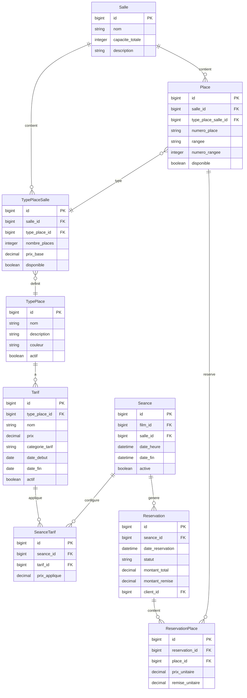

# Gestion des Types de Places par Salle

## 📋 Objectif

Gérer les types de places dans chaque salle avec des tarifs différenciés et calculer le revenu maximum par séance.

## 🗄️ Modèle Conceptuel de Données (MCD)

### Entités



### Relations

1. **Salle** → **TypePlaceSalle** (1,N) : Une salle peut avoir plusieurs types de places
2. **TypePlace** → **TypePlaceSalle** (1,N) : Un type de place peut être utilisé dans plusieurs salles
3. **TypePlaceSalle** → **Place** (1,N) : Un type de place dans une salle définit plusieurs places
4. **TypePlace** → **Tarif** (1,N) : Un type de place peut avoir plusieurs tarifs
5. **Tarif** → **SeanceTarif** (1,N) : Un tarif peut s'appliquer à plusieurs séances
6. **Seance** → **SeanceTarif** (1,N) : Une séance peut avoir plusieurs tarifs appliqués

## 🎨 Écrans et Fonctionnalités

### 1. Page Administration des Types de Places

#### URL : `/admin/types-places`

#### Dessin d'écran :

```
┌─────────────────────────────────────────────────────────────────────────────┐
│                           TYPES DE PLACES                                 │
├─────────────────────────────────────────────────────────────────────────────┤
│                                                                             │
│  [🏠 Admin] [🎬 Types de Places]                                           │
│                                                                             │
│  ┌─ Actions ─────────────────────────────────────────────────────────────┐   │
│  │  [➕ Ajouter un type]  [📊 Voir les revenus]  [🔄 Actualiser]        │   │
│  └─────────────────────────────────────────────────────────────────────┘   │
│                                                                             │
│  ┌─ Filtres ─────────────────────────────────────────────────────────────┐   │
│  │  🔍 Rechercher: [________________]  📅 Statut: [Tous ▼]              │   │
│  └─────────────────────────────────────────────────────────────────────┘   │
│                                                                             │
│  ┌─ Liste des Types de Places ──────────────────────────────────────────┐   │
│  │  ┌─ VIP ─────────────────────────────────────────────────────────┐   │   │
│  │  │  🎭 VIP                        💰 25.00€  ✅ Actif           │   │   │
│  │  │  Places premium avec service inclus                            │   │   │
│  │  │  [✏️ Modifier]  [🗑️ Supprimer]  [⚙️ Configurer salles]      │   │   │
│  │  └─────────────────────────────────────────────────────────────────┘   │   │
│  │                                                                     │   │
│  │  ┌─ Standard ─────────────────────────────────────────────────────┐   │   │
│  │  │  🪑 Standard                   💰 12.00€  ✅ Actif           │   │   │
│  │  │  Places standard avec vue normale                            │   │   │
│  │  │  [✏️ Modifier]  [🗑️ Supprimer]  [⚙️ Configurer salles]      │   │   │
│  │  └─────────────────────────────────────────────────────────────────┘   │   │
│  │                                                                     │   │
│  │  ┌─ Étudiant ─────────────────────────────────────────────────────┐   │   │
│  │  │  🎓 Étudiant                   💰 8.00€   ✅ Actif           │   │   │
│  │  │  Tarif réduit pour étudiants (sur présentation)               │   │   │
│  │  │  [✏️ Modifier]  [🗑️ Supprimer]  [⚙️ Configurer salles]      │   │   │
│  │  └─────────────────────────────────────────────────────────────────┘   │   │
│  └─────────────────────────────────────────────────────────────────────────┘
│                                                                             │
│  ┌─ Statistiques ────────────────────────────────────────────────────────┐   │
│  │  📊 3 types de places configurés  💰 Revenu moyen: 15.00€             │   │
│  └─────────────────────────────────────────────────────────────────────────┘   │
└─────────────────────────────────────────────────────────────────────────────┘
```

#### Modal d'ajout/modification :

```
┌─────────────────────────────────────────────────────────────────────────────┐
│                           AJOUTER UN TYPE                                 │
├─────────────────────────────────────────────────────────────────────────────┤
│                                                                             │
│  ┌─ Informations ─────────────────────────────────────────────────────────┐   │
│  │  Nom du type: [VIP________________]                                    │   │
│  │  Description: [Places premium avec service inclus____________]        │   │
│  │  Couleur d'affichage: [🟣]                                            │   │
│  │  Statut: [✅ Actif]                                                   │   │
│  └─────────────────────────────────────────────────────────────────────────┘   │
│                                                                             │
│  ┌─ Tarification ───────────────────────────────────────────────────────┐   │
│  │  Prix de base: [25.00€]                                               │   │
│  │  Catégorie tarifaire: [Premium ▼]                                    │   │
│  └─────────────────────────────────────────────────────────────────────────┘   │
│                                                                             │
│  ┌─ Actions ─────────────────────────────────────────────────────────────┐   │
│  │                                      [❌ Annuler]  [💾 Enregistrer]    │   │
│  └─────────────────────────────────────────────────────────────────────────┘   │
└─────────────────────────────────────────────────────────────────────────────┘
```

### 2. Page Configuration des Places par Salle

#### URL : `/admin/salles/{salleId}/places`

#### Dessin d'écran :

```
┌─────────────────────────────────────────────────────────────────────────────┐
│                      CONFIGURATION DES PLACES                             │
├─────────────────────────────────────────────────────────────────────────────┤
│                                                                             │
│  🏠 Admin > 🏢 Salles > 🎬 Salle 1 > 🪑 Configuration des Places           │
│                                                                             │
│  ┌─ Informations Salle ───────────────────────────────────────────────────┐   │
│  │  🎬 Salle 1 - Capacité: 100 places  📊 Revenu max: 1,340.00€/séance   │   │
│  └─────────────────────────────────────────────────────────────────────────┘   │
│                                                                             │
│  ┌─ Types de Places Disponibles ────────────────────────────────────────┐   │
│  │  🟣 VIP (25.00€)  🪑 Standard (12.00€)  🎓 Étudiant (8.00€)           │   │
│  │  ┌─ Configuration ─────────────────────────────────────────────────┐   │   │
│  │  │  🟣 VIP:       [20] places  💰 [25.00€]  [✅ Disponible]        │   │   │
│  │  │  🪑 Standard:  [50] places  💰 [12.00€]  [✅ Disponible]        │   │   │
│  │  │  🎓 Étudiant:  [30] places  💰 [8.00€]   [✅ Disponible]        │   │   │
│  │  └─────────────────────────────────────────────────────────────────┘   │   │
│  │                                      [🔄 Générer les places]          │   │
│  └─────────────────────────────────────────────────────────────────────────┘   │
│                                                                             │
│  ┌─ Grille des Places ───────────────────────────────────────────────────┐   │
│  │        Écran    ┌─A─┬─B─┬─C─┬─D─┬─E─┬─F─┬─G─┬─H─┬─I─┬─J─┐            │   │
│  │  ┌─1─┐ 🟣 🟣 🟣 🟣 🟣 🟣 🟣 🟣 🟣 🟣 🟣 🟣 🟣 🟣 🟣 🟣 🟣 🟣 🟣 🟣 🟣 🟣 🟣 🟣 │   │
│  │  │ 2 │ 🟣 🟣 🟣 🟣 🟣 🟣 🟣 🟣 🟣 🟣 🟣 🟣 🟣 🟣 🟣 🟣 🟣 🟣 🟣 🟣 🟣 🟣 🟣 🟣 │   │
│  │  │ 3 │ 🪑 🪑 🪑 🪑 🪑 🪑 🪑 🪑 🪑 🪑 🪑 🪑 🪑 🪑 🪑 🪑 🪑 🪑 🪑 🪑 🪑 🪑 🪑 🪑 │   │
│  │  │ 4 │ 🪑 🪑 🪑 🪑 🪑 🪑 🪑 🪑 🪑 🪑 🪑 🪑 🪑 🪑 🪑 🪑 🪑 🪑 🪑 🪑 🪑 🪑 🪑 🪑 │   │
│  │  │ 5 │ 🪑 🪑 🪑 🪑 🪑 🪑 🪑 🪑 🪑 🪑 🪑 🪑 🪑 🪑 🪑 🪑 🪑 🪑 🪑 🪑 🪑 🪑 🪑 🪑 │   │
│  │  │ 6 │ 🪑 🪑 🪑 🪑 🪑 🪑 🪑 🪑 🪑 🪑 🪑 🪑 🪑 🪑 🪑 🪑 🪑 🪑 🪑 🪑 🪑 🪑 🪑 🪑 │   │
│  │  │ 7 │ 🪑 🪑 🪑 🪑 🪑 🪑 🪑 🪑 🪑 🪑 🪑 🪑 🪑 🪑 🪑 🪑 🪑 🪑 🪑 🪑 🪑 🪑 🪑 🪑 │   │
│  │  │ 8 │ 🪑 🪑 🪑 🪑 🪑 🪑 🪑 🪑 🪑 🪑 🪑 🪑 🪑 🪑 🪑 🪑 🪑 🪑 🪑 🪑 🪑 🪑 🪑 🪑 │   │
│  │  │ 9 │ 🎓 🎓 🎓 🎓 🎓 🎓 🎓 🎓 🎓 🎓 🎓 🎓 🎓 🎓 🎓 🎓 🎓 🎓 🎓 🎓 🎓 🎓 🎓 🎓 │   │
│  │  │10 │ 🎓 🎓 🎓 🎓 🎓 🎓 🎓 🎓 🎓 🎓 🎓 🎓 🎓 🎓 🎓 🎓 🎓 🎓 🎓 🎓 🎓 🎓 🎓 🎓 │   │
│  │  └───┴──────────────────────────────────────────────────────────────────┘   │
│  │                                                                             │   │
│  │  🟣 VIP (20)  🪑 Standard (50)  🎓 Étudiant (30)  📊 Total: 100 places   │   │
│  └─────────────────────────────────────────────────────────────────────────┘   │
│                                                                             │
│  ┌─ Actions ───────────────────────────────────────────────────────────────┐   │
│  │  [🔄 Réinitialiser]  [💾 Sauvegarder]  [📊 Calculer revenu]  [📤 Exporter]│   │
│  └─────────────────────────────────────────────────────────────────────────┘   │
└─────────────────────────────────────────────────────────────────────────────┘
```

#### Calculateur de revenu :

```
┌─────────────────────────────────────────────────────────────────────────────┐
│                        CALCUL DU REVENU MAXIMUM                           │
├─────────────────────────────────────────────────────────────────────────────┤
│                                                                             │
│  🎬 Salle 1 - 100 places                                                   │
│                                                                             │
│  ┌─ Sélection du Film ─────────────────────────────────────────────────────┐   │
│  │  🎭 Film: [Avatar 2 ▼]  📅 Durée: 3h12min  🎬 Genre: Science-Fiction   │   │
│  │  📊 Nombre de séances/jour: [4]  🕐 Horaire type: 14h, 17h, 20h, 23h   │   │
│  └─────────────────────────────────────────────────────────────────────────┘   │
│                                                                             │
│  ┌─ Détail par Type de Place ───────────────────────────────────────────┐   │
│  │  🟣 VIP:                                                              │   │
│  │     20 places × 25.00€ = 500.00€  (37.3%)                            │   │
│  │     ████████████████████████████████████████░░░░░░░░░░░░░░░░░░░░░░   │   │
│  │                                                                     │   │
│  │  🪑 Standard:                                                         │   │
│  │     50 places × 12.00€ = 600.00€  (44.8%)                            │   │
│  │     ████████████████████████████████████████████████████████████████   │   │
│  │                                                                     │   │
│  │  🎓 Étudiant:                                                         │   │
│  │     30 places × 8.00€ = 240.00€  (17.9%)                             │   │
│  │     ████████████████████░░░░░░░░░░░░░░░░░░░░░░░░░░░░░░░░░░░░░░░░░   │   │
│  └─────────────────────────────────────────────────────────────────────────┘   │
│                                                                             │
│  ┌─ Résumé par Séance ───────────────────────────────────────────────────┐   │
│  │  💰 Revenu maximum par séance:      1,340.00€                         │   │
│  │  🎭 Film: Avatar 2                   � Salle: Salle 1                 │   │
│  │  🕐 Durée: 3h12min                   🎫 Places totales: 100            │   │
│  └─────────────────────────────────────────────────────────────────────────┘   │
│                                                                             │
│  ┌─ Projections par Période ──────────────────────────────────────────────┐   │
│  │  📅 Par jour:   4 séances × 1,340.00€ = 5,360.00€                     │   │
│  │  📊 Par semaine: 28 séances × 1,340.00€ = 37,520.00€                 │   │
│  │  📈 Par mois:   120 séances × 1,340.00€ = 160,800.00€                │   │
│  └─────────────────────────────────────────────────────────────────────────┘   │
│                                                                             │
│  ┌─ Actions ───────────────────────────────────────────────────────────────┐   │
│  │  [🎬 Changer de film]  [📊 Comparer films]  [📤 Exporter]  [❌ Fermer] │   │
│  └─────────────────────────────────────────────────────────────────────────┘   │
└─────────────────────────────────────────────────────────────────────────────┘
```

#### Comparaison entre films :

```
┌─────────────────────────────────────────────────────────────────────────────┐
│                      COMPARAISON DES REVENUS PAR FILM                       │
├─────────────────────────────────────────────────────────────────────────────┤
│                                                                             │
│  🎬 Salle 1 - Comparaison des revenus maximum par séance                    │
│                                                                             │
│  ┌─ Films en Diffusion ───────────────────────────────────────────────────┐   │
│  │  🎭 Avatar 2:                                                         │   │
│  │     💰 1,340.00€/séance  📊 4 séances/jour  📈 5,360.00€/jour         │   │
│  │     🎯 Popularité: ⭐⭐⭐⭐⭐  📅 Durée: 3h12min  🎫 Places: 100         │   │
│  │     ████████████████████████████████████████████████████████████████   │   │
│  │                                                                     │   │
│  │  🎭 Barbie:                                                           │   │
│  │     � 1,180.00€/séance  📊 5 séances/jour  📈 5,900.00€/jour         │   │
│  │     🎯 Popularité: ⭐⭐⭐⭐   📅 Durée: 1h54min  🎫 Places: 100         │   │
│  │     ████████████████████████████████████████████████████████████░░░░   │   │
│  │                                                                     │   │
│  │  🎭 Oppenheimer:                                                       │   │
│  │     💰 1,250.00€/séance  📊 4 séances/jour  📈 5,000.00€/jour         │   │
│  │     🎯 Popularité: ⭐⭐⭐⭐   📅 Durée: 3h00min  🎫 Places: 100         │   │
│  │     ██████████████████████████████████████████████████████████████░░░   │   │
│  └─────────────────────────────────────────────────────────────────────────┘   │
│                                                                             │
│  ┌─ Optimisation des Séances ─────────────────────────────────────────────┐   │
│  │  📊 Film le plus rentable: Avatar 2 (1,340.00€/séance)                │   │
│  │  📈 Film le plus productif: Barbie (5,900.00€/jour)                   │   │
│  │  🎯 Recommandation: Augmenter les séances Barbie à 6/jour              │   │
│  │  💡 Impact potentiel: +1,180.00€/jour supplémentaire                    │   │
│  └─────────────────────────────────────────────────────────────────────────┘   │
│                                                                             │
│  ┌─ Actions ───────────────────────────────────────────────────────────────┐   │
│  │  [📊 Voir détails]  [⚙️ Optimiser planning]  [📤 Exporter]  [❌ Fermer]│   │
│  └─────────────────────────────────────────────────────────────────────────┘   │
└─────────────────────────────────────────────────────────────────────────────┘
```

### 3. Dashboard de Revenus

#### URL : `/admin/revenus-salles`

#### Dessin d'écran :

```
┌─────────────────────────────────────────────────────────────────────────────┐
│                           DASHBOARD DES REVENUS                           │
├─────────────────────────────────────────────────────────────────────────────┤
│                                                                             │
│  🏠 Admin > 💰 Dashboard des Revenus                                        │
│                                                                             │
│  ┌─ Période ───────────────────────────────────────────────────────────────┐   │
│  │  📅 [Aujourd'hui ▼]  📊 Du: [01/01/2026]  Au: [15/01/2026]  [🔄]   │   │
│  └─────────────────────────────────────────────────────────────────────────┘   │
│                                                                             │
│  ┌─ Statistiques Globales ────────────────────────────────────────────────┐   │
│  │  💰 Revenu total: 125,680.00€  📈 +12.5% vs période précédente         │   │
│  │  🎬 Salles actives: 3/4        🎫 Taux occupation: 78.3%               │   │
│  │  📊 Revenu moyen/salle: 41,893.33€  🎯 Objectif mensuel: 150,000€     │   │
│  └─────────────────────────────────────────────────────────────────────────┘   │
│                                                                             │
│  ┌─ Graphique d'Évolution ─────────────────────────────────────────────────┐   │
│  │  📈 Revenus par jour (15 derniers jours)                                │   │
│  │  15k┤                                                                   │   │
│  │  12k┤      ●●●                                                         │   │
│  │   9k┤    ●●   ●●●    ●●●                                               │   │
│  │   6k┤  ●●       ●●●●●●●●●●●●●●●●●●●●●●●●●●●●●●●●●●●●●●●●●●●●●●●●●●●●│   │
│  │   3k┤                                                                   │   │
│  │    └─┬─┬─┬─┬─┬─┬─┬─┬─┬─┬─┬─┬─┬─┬─┬─┬─┬─┬─┬─┬─┬─┬─┬─┬─┬─┬─┬─┬─┬─┬─┬─┬─┬─┬─┬─┘   │   │
│  │     1 2 3 4 5 6 7 8 9 10 11 12 13 14 15                              │   │
│  └─────────────────────────────────────────────────────────────────────────┘   │
│                                                                             │
│  ┌─ Tableau des Salles ───────────────────────────────────────────────────┐   │
│  │  🏢 Salle    💰 Revenu     📊 Max/Séance  🎈 Occupation  📈 Tendance    │   │
│  │  ─────────────────────────────────────────────────────────────────────   │   │
│  │  🎬 Salle 1  45,230.00€   1,340.00€     82.3%        📈 +5.2%        │   │
│  │  🎭 Salle 2  38,450.00€   1,180.00€     76.8%        📈 +3.1%        │   │
│  │  🎪 Salle 3  42,000.00€   1,250.00€     79.1%        📉 -1.3%        │   │
│  │  🎨 Salle 4   0.00€      980.00€      0.0%         ⚠️ Inactive      │   │
│  └─────────────────────────────────────────────────────────────────────────┘   │
│                                                                             │
│  ┌─ Répartition par Type de Place ────────────────────────────────────────┐   │
│  │  🟣 VIP:       35.2%  (44,200.00€)  ████████████████████████████████   │   │
│  │  🪑 Standard:  48.7%  (61,250.00€)  ████████████████████████████████████│   │
│  │  🎓 Étudiant:  16.1%  (20,230.00€)  ████████████░░░░░░░░░░░░░░░░░░░░░░   │   │
│  └─────────────────────────────────────────────────────────────────────────┘   │
│                                                                             │
│  ┌─ Actions ───────────────────────────────────────────────────────────────┐   │
│  │  [📤 Exporter CSV]  [📊 Rapport détaillé]  [⚙️ Configuration]  [🔄 Actualiser]│   │
│  └─────────────────────────────────────────────────────────────────────────┘   │
└─────────────────────────────────────────────────────────────────────────────┘
```

#### Détail d'une salle :

```
┌─────────────────────────────────────────────────────────────────────────────┐
│                           DÉTAILS SALLE 1                                 │
├─────────────────────────────────────────────────────────────────────────────┤
│                                                                             │
│  🏠 Admin > 💰 Dashboard > 🎬 Salle 1                                       │
│                                                                             │
│  ┌─ Informations ───────────────────────────────────────────────────────────┐   │
│  │  🎬 Salle 1  📊 Capacité: 100 places  💰 Revenu max: 1,340.00€/séance   │   │
│  │  📈 Revenu période: 45,230.00€  🎈 Occupation: 82.3%  📊 Séances: 34     │   │
│  └─────────────────────────────────────────────────────────────────────────┘   │
│                                                                             │
│  ┌─ Performance par Type de Place ────────────────────────────────────────┐   │
│  │  🟣 VIP (20 places):                                                    │   │
│  │     💰 Revenu: 15,920.00€  🎈 Occupation: 89.2%  📊 Revenu/séance: 468.24€│   │
│  │     📈 Tendance: 📈 +2.3%  🎯 Performance: ⭐⭐⭐⭐⭐                      │   │
│  │                                                                     │   │
│  │  🪑 Standard (50 places):                                              │   │
│  │     💰 Revenu: 22,050.00€  🎈 Occupation: 81.7%  📊 Revenu/séance: 648.53€│   │
│  │     📈 Tendance: 📈 +1.8%  🎯 Performance: ⭐⭐⭐⭐                       │   │
│  │                                                                     │   │
│  │  🎓 Étudiant (30 places):                                               │   │
│  │     💰 Revenu: 7,260.00€   🎈 Occupation: 76.5%  📊 Revenu/séance: 213.53€ │   │
│  │     📈 Tendance: 📉 -0.5%  🎯 Performance: ⭐⭐⭐                         │   │
│  └─────────────────────────────────────────────────────────────────────────┘   │
│                                                                             │
│  ┌─ Séances Détail ───────────────────────────────────────────────────────┐   │
│  │  📅 Date        🕐 Heure  💰 Revenu  🎈 Occupation  🎫 Places vendues    │   │
│  │  ─────────────────────────────────────────────────────────────────────   │   │
│  │  15/01/2026   14:00    1,156.00€   86.3%        86/100                 │   │
│  │  15/01/2026   17:00    1,089.00€   81.2%        81/100                 │   │
│  │  15/01/2026   20:00    1,224.00€   91.3%        91/100                 │   │
│  │  14/01/2026   14:00    1,089.00€   81.2%        81/100                 │   │
│  │  ...                                                                 ... │   │
│  └─────────────────────────────────────────────────────────────────────────┘   │
│                                                                             │
│  ┌─ Actions ───────────────────────────────────────────────────────────────┐   │
│  │  [📊 Voir grille]  [📤 Exporter données]  [⚙️ Configurer]  [❌ Fermer]    │   │
│  └─────────────────────────────────────────────────────────────────────────┘   │
└─────────────────────────────────────────────────────────────────────────────┘
```

## 🎯 Légende des icônes et couleurs

### Types de places :
- 🟣 **VIP** : Places premium avec tarif élevé
- 🪑 **Standard** : Places standard avec tarif moyen  
- 🎓 **Étudiant** : Places tarif réduit
- 🎮 **Enfant** : Places pour enfants
- ♿ **PMR** : Places accessibles

### Statuts :
- ✅ **Actif** : Disponible à la vente
- ❌ **Inactif** : Temporairement indisponible
- ⚠️ **Attention** : Problème à vérifier

### Tendances :
- 📈 **Hausse** : Performance en augmentation
- 📉 **Baisse** : Performance en baisse
- ➡️ **Stable** : Performance constante

### Performance :
- ⭐⭐⭐⭐⭐ **Excellent** : >90% du potentiel
- ⭐⭐⭐⭐ **Très bon** : 75-90% du potentiel
- ⭐⭐⭐ **Bon** : 60-75% du potentiel
- ⭐⭐ **Moyen** : 40-60% du potentiel
- ⭐ **Faible** : <40% du potentiel

#### Fonctions :

```javascript
// TypesPlacesController.java
@GetMapping("/types-places")
public ResponseEntity<List<TypePlace>> getAllTypesPlaces() {
    // Retourne tous les types de places disponibles
}

@PostMapping("/types-places")
public ResponseEntity<TypePlace> createTypePlace(@RequestBody TypePlace typePlace) {
    // Crée un nouveau type de place
}

@PutMapping("/types-places/{id}")
public ResponseEntity<TypePlace> updateTypePlace(@PathVariable Long id, @RequestBody TypePlace typePlace) {
    // Met à jour un type de place
}

@GetMapping("/salles/{salleId}/types-places")
public ResponseEntity<List<TypePlaceSalle>> getTypesPlacesBySalle(@PathVariable Long salleId) {
    // Retourne les types de places configurés pour une salle
}

@PostMapping("/salles/{salleId}/types-places")
public ResponseEntity<TypePlaceSalle> addTypePlaceToSalle(
    @PathVariable Long salleId, 
    @RequestBody TypePlaceSalle typePlaceSalle
) {
    // Ajoute un type de place à une salle avec nombre de places et prix
}

@DeleteMapping("/types-places-salle/{id}")
public ResponseEntity<Void> deleteTypePlaceFromSalle(@PathVariable Long id) {
    // Supprime un type de place d'une salle
}

// RevenusController.java - Fonctions pour les revenus par film
@GetMapping("/salles/{salleId}/revenu-max-film/{filmId}")
public ResponseEntity<RevenuMaxFilm> getRevenuMaxByFilm(
    @PathVariable Long salleId, 
    @PathVariable Long filmId
) {
    // Calcule le revenu maximum par séance pour un film spécifique
}

@GetMapping("/salles/{salleId}/comparaison-films")
public ResponseEntity<List<RevenuFilmCompare>> compareFilmsRevenue(@PathVariable Long salleId) {
    // Compare les revenus maximum pour tous les films en diffusion
}

@PostMapping("/salles/{salleId}/optimiser-seances")
public ResponseEntity<OptimisationResult> optimiserSeances(
    @PathVariable Long salleId,
    @RequestBody OptimisationRequest request
) {
    // Optimise le planning des séances pour maximiser les revenus
}
```

#### Types de retour spécifiques :

```typescript
// Revenu maximum par film et séance
interface RevenuMaxFilm {
  filmId: number;
  filmTitre: string;
  filmDuree: string;
  filmGenre: string;
  salleId: number;
  salleNom: string;
  revenuMaxSeance: number;
  nombrePlacesTotal: number;
  nombreSeancesJour: number;
  revenuMaxJour: number;
  revenuMaxSemaine: number;
  revenuMaxMois: number;
  detailsTypes: TypePlaceRevenue[];
}

// Comparaison entre films
interface RevenuFilmCompare {
  filmId: number;
  filmTitre: string;
  revenuMaxSeance: number;
  nombreSeancesJour: number;
  revenuMaxJour: number;
  popularite: number; // 1-5 étoiles
  duree: string;
  pourcentageOptimal: number;
  recommandation: string;
}

// Résultat d'optimisation
interface OptimisationResult {
  salleId: number;
  filmsOptimises: FilmOptimise[];
  revenuTotalActuel: number;
  revenuTotalOptimise: number;
  gainPotentiel: number;
  pourcentageAmelioration: number;
  recommandations: string[];
}

interface FilmOptimise {
  filmId: number;
  filmTitre: string;
  seancesActuelles: number;
  seancesRecommandees: number;
  revenuActuel: number;
  revenuPotentiel: number;
  impact: number;
}
```

#### Boutons et Actions :

| Bouton | Action | Fonction appelée | Type de retour |
|--------|--------|------------------|----------------|
| "Ajouter un type" | Ouvre le formulaire | `showAddTypeForm()` | `void` |
| "Modifier" | Ouvre le formulaire avec données | `editTypePlace(typePlace)` | `void` |
| "Supprimer" | Confirme et supprime | `deleteTypePlace(id)` | `Promise<boolean>` |
| "Configurer pour cette salle" | Navigation vers configuration salle | `goToSalleConfig(salleId)` | `void` |
| "Calculer revenu max" | Affiche le revenu potentiel | `calculateMaxRevenue(salleId)` | `Promise<decimal>` |
| "🎬 Changer de film" | Sélectionne un autre film | `selectFilm(filmId)` | `Promise<RevenuMaxFilm>` |
| "📊 Comparer films" | Compare les revenus entre films | `compareFilmsRevenue(salleId)` | `Promise<List<RevenuFilmCompare>>` |
| "⚙️ Optimiser planning" | Optimise le nombre de séances | `optimiserSeances(salleId, request)` | `Promise<OptimisationResult>` |

### 2. Page Configuration des Places par Salle

#### URL : `/admin/salles/{salleId}/places`

#### Composants :
- **`SallePlacesConfigPage.vue`** : Page de configuration
- **`PlaceGrid.vue`** : Grille visuelle des places
- **`TypePlaceSelector.vue** : Sélecteur de type de place
- **`RevenueCalculator.vue`** : Calculateur de revenu

#### Fonctions :

```javascript
// SallePlacesController.java
@GetMapping("/salles/{salleId}/places")
public ResponseEntity<List<Place>> getPlacesBySalle(@PathVariable Long salleId) {
    // Retourne toutes les places d'une salle avec leur type
}

@PostMapping("/salles/{salleId}/places/generate")
public ResponseEntity<List<Place>> generatePlaces(
    @PathVariable Long salleId,
    @RequestBody List<TypePlaceSalle> typesPlaces
) {
    // Génère les places selon la configuration
}

@PutMapping("/places/{id}/type")
public ResponseEntity<Place> updatePlaceType(
    @PathVariable Long id,
    @RequestBody PlaceTypeUpdateRequest request
) {
    // Met à jour le type d'une place spécifique
}

@GetMapping("/salles/{salleId}/revenu-max")
public ResponseEntity<RevenueInfo> calculateMaxRevenue(@PathVariable Long salleId) {
    // Calcule le revenu maximum par séance
}
```

#### Boutons et Actions :

| Bouton | Action | Fonction appelée | Type de retour |
|--------|--------|------------------|----------------|
| "Générer les places" | Crée les places selon configuration | `generatePlaces()` | `Promise<List<Place>>` |
| "Réinitialiser la grille" | Vide toutes les places | `resetGrid()` | `Promise<void>` |
| "Appliquer le type" | Applique le type sélectionné aux places cochées | `applyTypeToSelected()` | `Promise<void>` |
| "Calculer le revenu max" | Affiche le calcul de revenu | `showRevenueCalculation()` | `Promise<RevenueInfo>` |
| "Sauvegarder la configuration" | Enregistre la configuration | `saveConfiguration()` | `Promise<boolean>` |

### 3. Dashboard de Revenus

#### URL : `/admin/revenus-salles`

#### Composants :
- **`RevenusSalleDashboard.vue`** : Dashboard principal
- **`SalleRevenueChart.vue`** : Graphique des revenus
- **`RevenueTable.vue`** : Tableau détaillé

#### Fonctions :

```javascript
// RevenusController.java
@GetMapping("/revenus/salles")
public ResponseEntity<List<SalleRevenueInfo>> getAllSallesRevenue() {
    // Retourne les revenus de toutes les salles
}

@GetMapping("/revenus/salles/{salleId}")
public ResponseEntity<SalleRevenueDetail> getSalleRevenueDetail(@PathVariable Long salleId) {
    // Retourne le détail des revenus d'une salle
}

@GetMapping("/revenus/salles/{salleId}/periode")
public ResponseEntity<List<RevenuePeriod>> getSalleRevenueByPeriod(
    @PathVariable Long salleId,
    @RequestParam String periode,
    @RequestParam LocalDate dateDebut,
    @RequestParam LocalDate dateFin
) {
    // Retourne les revenus par période
}
```

#### Boutons et Actions :

| Bouton | Action | Fonction appelée | Type de retour |
|--------|--------|------------------|----------------|
| "Actualiser" | Recharge les données | `refreshData()` | `Promise<void>` |
| "Exporter en CSV" | Exporte les données | `exportToCSV()` | `Promise<Blob>` |
| "Filtrer par période" | Applique un filtre temporel | `applyPeriodFilter()` | `Promise<void>` |
| "Détails de la salle" | Affiche le détail d'une salle | `showSalleDetail(salleId)` | `void` |

## 📊 Calcul du Revenu Maximum

### Formule de calcul

```
Revenu Max Séance = Σ(Tarif_Type_Place × Nombre_Places_Type)
```

### Exemple

Pour une salle avec :
- 20 places VIP à 25€
- 50 places Standard à 12€  
- 30 places Étudiant à 8€

```
Revenu Max = (20 × 25€) + (50 × 12€) + (30 × 8€)
           = 500€ + 600€ + 240€
           = 1 340€ par séance
```

### Types de retour des fonctions

```typescript
// Type pour les informations de revenu
interface RevenueInfo {
  salleId: number;
  salleNom: string;
  revenuMaxSeance: number;
  revenuMaxJour: number;
  revenuMaxSemaine: number;
  revenuMaxMois: number;
  details: TypePlaceRevenue[];
}

interface TypePlaceRevenue {
  typePlaceId: number;
  typePlaceNom: string;
  nombrePlaces: number;
  prixUnitaire: number;
  revenuTotal: number;
  pourcentageTotal: number;
}

// Type pour la configuration des places
interface TypePlaceSalle {
  id: number;
  salleId: number;
  typePlaceId: number;
  nombrePlaces: number;
  prixBase: number;
  disponible: boolean;
}

// Type pour une place individuelle
interface Place {
  id: number;
  salleId: number;
  typePlaceSalleId: number;
  numeroPlace: string;
  rangee: string;
  numeroRangee: number;
  disponible: boolean;
}
```
j
## 🔄 Flux de travail

1. **Configuration des types de places** : Admin crée les types (VIP, Standard, Étudiant, etc.)
2. **Configuration par salle** : Pour chaque salle, admin définit combien de places de chaque type
3. **Génération des places** : Système génère automatiquement les places individuelles
4. **Configuration des tarifs** : Admin définit les tarifs par type de place et par période
5. **Calcul des revenus** : Système calcule automatiquement le revenu maximum par séance

## 🎯 Avantages

- **Flexibilité** : Chaque salle peut avoir sa propre configuration
- **Tarification dynamique** : Les tarifs peuvent varier selon les périodes - **Optimisation** : Calcul précis du revenu potentiel
- **Visibilité** : Dashboard complet pour l'analyse des revenus
